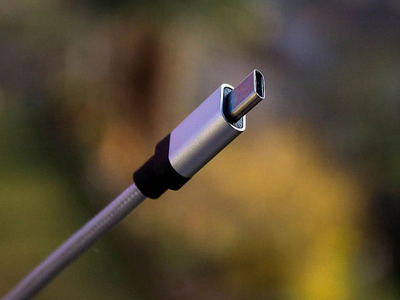

# Документация tbell
## Описание продукта
Tbell - программно-аппаратный комплекс (проще устройства и программное обеспечение) для автоматизация подачи звонков в учебных учреждениях. Проект является открытым (open-source) и использует лицензию GPL. Аппаратную часть проекта представляет микроконтроллер esp8266 в исполнении esp01s (может быть заменён на аналогичные esp8266 с объёмом flash  1MB). Программную часть можно разделить на 2 ветви:

1. Программа для микроконтроллера. Использован фреймворк Arduino.h и среда разработки Platform.io для vscode.
2. Веб конфигуратор расписания. Использован JavaScript, исполняемый в браузере пользователя, это предполагает возможность использования данного конфигуратора локально.

## Инструкция по сборке
Её нет (пока).

## Инструкция по использованию (подробная)
- Для начала работы смонтируйте устройство вместо штатной кнопки для подачи звонков.
- Подключите устройство к питанию, вставив в его порт кабель (в качестве источника питания подойдёт зарядное устройство для смартфона и кабель на usb type-c)

- На мобильном устройстве или компьютере с wifi включите, собственно, wifi, затем найдите сеть **tbell**. Подключитесь к ней, используя пароль **tbell_password**.
- После подключения перейдите по адресу [_http://192.168.4.1:5000_](http://192.168.4.1:5000), используя любой браузер
- На странице введите ssid (название основной сети wifi) и её пароль, после ввода этих данных нажмите на кнопку "Подключиться", вы увидите страницу о успешном сохранении данных и перезагрузке устройства. Процесс автоматизирован, ваши действия не требуются. В случае ввода правильных данных и доступности сети устройство подключится к сети, а точка tbell пропадёт. При неудачно подключении устройство перезагрузится, а процесс можно будет повторить. Что делать если точка tbell не пропала и устройство не подключилось к основной сети wifi:
1. Проверьте адаптер и кабель питания, попробуйте другие.
2. Проверьте данные сети, удостоверьтесь в корректном их вводе.
3. Отключите и подключите устройсво к питанию.
4. Проверьте наличие и стабильность сигнала сети wifi, удостоверьтесь что она имеет часоту 2,4 Ггц.
5. Поверье конфигурацию маршрутизатора (попросите это сделать системного администратора), конфигурация должа позволять подключение новых устройств и работу dhcp. На счёт этого не стоит особо беспокоится так как обычно марштутизатор настроен именно так с завода.
- Перейдите на [_https://torteckyt.github.io/tbell.github.io/_](https://torteckyt.github.io/tbell.github.io/) и создайте расписние. Для включения/выключения предупреждающего звнока воспользуйтесь галочкой "предупреждающий звонок", для изменения интервала между предупреждающим и основным звонками измените число в поле "подать за". Для выбора дня измените значение "день недели". Для добавления урока нажмите "добавить урок", для удаления "убрать урок". По окончании редактирование одного дня нажмите "сохранить", затем выберите другой день. По окончании редактирования всех дней нажмите кнопку "готово", строка-расписание будет скопирована автоматически. **Внимание**: Настройка предупреждающего звонка является ОТДЕЛЬНОЙ для каждого дня. Сохранение нужно производить после окончания редактирования КАЖДОГО дня. Предупреждающий звонок подаётся только до звонка НА УРОК.
- Теперь вам нужно узнать ip адрес устройства в сети, это можно сделать, зайдя в панель управления маршрутизатора (попросить сделать это системного администратора), MAC адрес устройста идёт вместе с ним, рекомендуется сделать ip адрес устройства статическим.
- После получения ip адреса устройства перейдите в браузере на _[ip адресс устройства]:5000_. В поле "строка-расписание" вставте полученную после составления расписания (она была скопирована в ваш буфер обмена автоматически). В поле пароль введите пароль редактирования (он идёт вместе с устройством). При вводе верного пароля вы получите сообщение о успешном сохранении расписания и перезагрузке устройства. Процесс автоматизирован, ваши действия не требуются. При неверном вводе пароля вы получите сообщение об этом, повторите попытку.
- Поздравляю! Вы закончили с настройкой tbell.

### По вопросам писать @torteck в телеграм, пожалуйста указывайте цель сообщения сразу. По найденым ошибкам/багам пишите в телегам или в github issues [https://github.com/TorteckYT/tbell.github.io/issues](https://github.com/TorteckYT/tbell.github.io/issues).